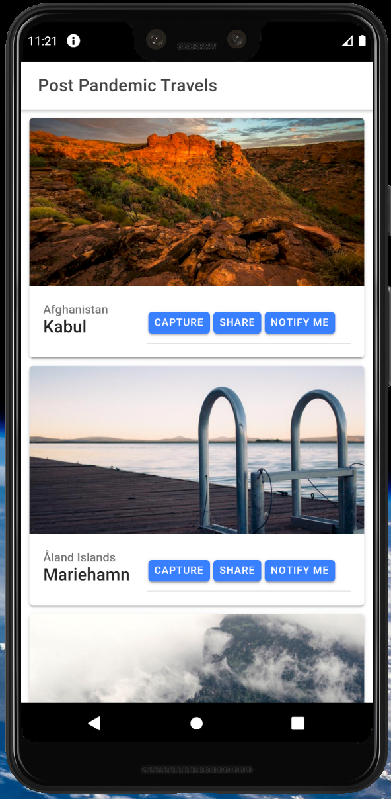

# Ionic and Apollo Client 3

#### To start

- open Android studio
- open an android emulator

#### Create ionic react

```bash
$ npm i -g @ionic/cli
$ ionic start ionic-react-demo --type react
```

##### For web

```bash
$ ionic serve
```

##### For mobile

```
$ ionic build
$ npx cap add android
$ npx cap add ios
$ npx cap open android
$ npx cap open ios
$ ionic capacitor run android --livereload --external
$ ionic capacitor run ios --livereload
```

#### TODO

- https://ionicframework.com/docs/native/push
- https://ionicframework.com/docs/native/local-notifications
- https://ionicframework.com/docs/native/social-sharing


